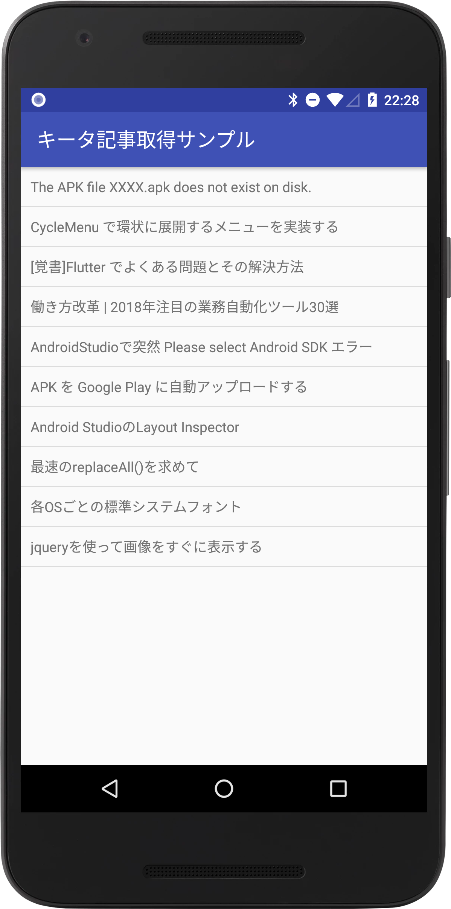
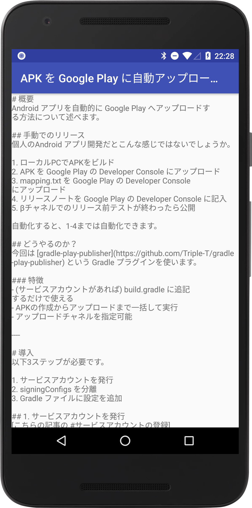

# qiita-sample

### 概要
Qiitaの記事一覧を表示し、記事名をタップすると詳細画面に遷移するAndroidサンプルアプリ。

### 要件
* **大規模なアプリ開発を想定した設計であること**
* **２画面以上の構成**
* **何かしらの非同期通信**
* **非同期通信の結果により画面上の表示が変更**

### 設計

当リポジトリの設計は、 MVPの設計と[Clean Architecture](https://8thlight.com/blog/uncle-bob/2012/08/13/the-clean-architecture.html)を組み合わせた設計を採用。
以後、この設計を「MVP-Clean」アーキテクチャと表記する。

#### 採用理由
要件であるように「大規模開発」を想定していることや、Android特有の課題を解決することを踏まえ、以下のポイントからMVP-Cleanを採用している。

* **役割の明確な分離**: Viewやビジネスロジック、データリポジトリを明確に分離し、大規模開発をしやすくする。
* **テストコードの書きやすさ**: 明確な役割分離からテストコードの記述がしやすくなる。
* **Activityの肥大化の防止**: Activityのコード記述が増え肥大化することを防止する。
* **思想の統一**: 知名度の高いCleanアーキテクチャをベースにすることにより、複数開発における思想に統一性を持たせる。

#### 参考

MVPとClean Archtectureを組み合わせて作成された[Googleのサンプルコード](https://github.com/googlesamples/android-architecture/tree/todo-mvp-clean)を参考にしている。

#### クラス構成

*クラスイメージ

### 完成図

|記事一覧画面|記事詳細画面|
|---|---|
|||

* **２画面以上の構成**: Qiitaの記事一覧(Android関連)を１画面目に表示し、記事名をタップすると本文を表示する画面に遷移。
* **何かしらの非同期通信**: Qiitaの記事取得APIと通信を行う。
* **非同期通信の結果により画面上の表示が変更**: QiitaのAPIから取得した結果をListViewへ反映。

### 利用ライブラリ

* **[Gson](https://github.com/google/gson)**
* **[EventBus](https://github.com/greenrobot/EventBus)**
* **[OKHttp3](https://github.com/square/okhttp)**

### ビルド手順